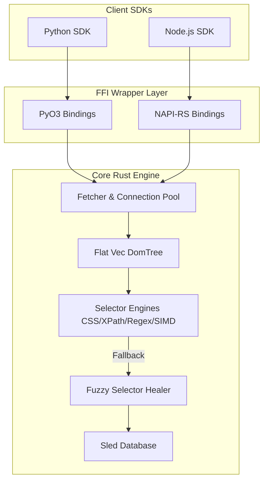

# Crawlingo Developer Handbook

This developer handbook serves as your resource for understanding, extending, and debugging Crawlingo.

---

## 1. System Architecture Overview

Crawlingo is a multi-language library wrapper built around a high-performance core Rust engine.

---

## 2. Core Design Decisions

### Flat DOM Tree Representation
To optimize heap allocation overhead, the HTML document is parsed into a flat vector `Vec<DomNode>`. Relationships are stored as `usize` index offsets, eliminating recursive pointers and cycle-reference memory leaks in Rust.

### Native wrappers (FFI)
Crawlingo compiles to native binary extensions for Python (via `PyO3`) and Node.js (via `napi-rs`). FFI boundary methods share elements using flat node indices, bypassing the need to copy HTML strings across languages.

---

## 3. Directory Map

- `/src/engine`: Manages networking via `wreq`, session states, DNS cache, and token-bucket host rate limiting.
- `/src/parser`: Streaming parser constructed on top of `lol_html`.
- `/src/selector`: Resolves elements matching CSS, XPath, Regex patterns, or SIMD-accelerated text anchors.
- `/src/matcher`: Parallel similarity scoring evaluating Jaro-Winkler and Jaccard metrics to heal broken selectors.
- `/src/fingerprint`: Fingerprint database utilities built with `sled`.
- `/src/dataset`: Structured extraction engine mapping DOM elements to JSON, CSV, or Parquet files.
- `/sdk/python`: Maturin package for Python.
- `/sdk/nodejs`: NAPI-RS package for JavaScript/TypeScript.
