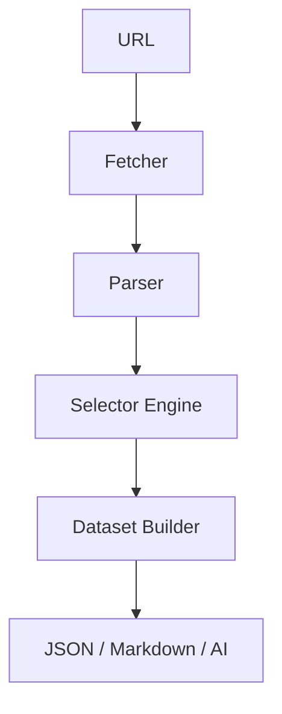

<h1 align="center">
    <a href="https://crawlingo.dev">
        
    </a>
    <br>
    <small>Effortless Self-Healing Web Scraping for the Modern Web</small>
</h1>

<p align="center">
    <a href="https://github.com/Vamshavardhan50/crawlingo/actions/workflows/ci.yml"></a>
    <a href="https://pypi.org/project/crawlingo/"></a>
    <a href="https://www.npmjs.com/package/crawlingo"></a>
    <a href="https://github.com/Vamshavardhan50/crawlingo/blob/main/LICENSE"></a>
    <a href="https://github.com/Vamshavardhan50/crawlingo/stargazers"></a>
</p>

<p align="center">
    <a href="#installation"><strong>Installation</strong></a>
    &middot;
    <a href="#why-crawlingo"><strong>Why Crawlingo</strong></a>
    &middot;
    <a href="#features"><strong>Core Features</strong></a>
    &middot;
    <a href="#quick-start"><strong>Quick Start</strong></a>
    &middot;
    <a href="#ai-benchmarks"><strong>LLM Benchmarks</strong></a>
    &middot;
    <a href="#performance"><strong>Performance</strong></a>
    &middot;
    <a href="#architecture"><strong>Architecture</strong></a>
</p>

---

**Crawlingo** is an adaptive, high-performance web crawling and data extraction framework designed to survive website structure updates. By wrapping a compiled Rust core in developer-first Python and JavaScript APIs, Crawlingo provides cross-language, zero-copy, self-healing selectors under the hood.

Its parser tracks DOM layouts and dynamically repairs selector mappings if elements drift. Its wreq-based fetchers bypass bot protection without headless browser overhead. And its built-in Model Context Protocol (MCP) server feeds structured web content directly to autonomous AI agents. One core engine, zero compromises.

📚 **Read the full guide and API references at [crawlingo.dev/docs](https://crawlingo.dev/docs)**

---

## 🎥 30-Second Demo

Watch Crawlingo's self-healing DOM selector engine dynamically recover element references when a website's layout/DOM structure drifts:


### How Self-Healing Works Under the Hood:
1. **Drift Detection**: When the target element (e.g., `button#submit.btn-primary`) undergoes styling or structure updates (e.g., renamed to `button#send-btn.btn-primary-new`), traditional scrapers fail and return empty results.
2. **Dynamic DOM Parsing**: Crawlingo's Rust engine intercepts the mismatch, loads the active DOM, and isolates candidates within the parent node coordinates.
3. **Jaro-Winkler Similarity Comparison**: The engine ranks candidates by checking tag names, surrounding attributes, text contents, and deep structural fingerprints.
4. **Auto-Match Recovery**: The candidate with the highest similarity score exceeding the threshold (e.g., **94% confidence**) is automatically bound, updating the cache without breaking your production data pipeline.

---

## 📦 Installation

<a id="installation"></a>

### Python SDK
```bash
pip install crawlingo
```

### Node.js SDK
```bash
npm install crawlingo
```

### Rust Crate
```toml
[dependencies]
crawlingo = "0.1.0"
```

---

## 🚀 Why Crawlingo?

<a id="why-crawlingo"></a>

Traditional scrapers break when websites change their class names, IDs, or HTML structures (**selector drift**). Crawlingo solves this by caching element layout fingerprints and using similarity matching heuristics to self-heal and find drifted elements on the fly.

### Comparison Matrix

| Feature | Crawlingo | Scrapy | Crawl4AI |
|----------|------------|---------|---------|
| Rust Core | ✅ | ❌ | ❌ |
| Python SDK | ✅ | ✅ | ✅ |
| Node SDK | ✅ | ❌ | ❌ |
| AI Agent Ready | ✅ | ⚠️ | ✅ |
| Change Monitoring | ✅ | ❌ | ❌ |
| Dataset Extraction | ✅ | ⚠️ | ⚠️ |
| Cross Language | ✅ | ❌ | ❌ |

---

## 🛠️ Core Features

<a id="features"></a>

Crawlingo packs all components required to scrape, watch, and pipe modern web pages under high anti-bot environments:

*   **🧠 Self-Healing DOM Fingerprinting**: Tracks layout changes and leverages Jaro-Winkler calculations alongside relative parent-sibling offsets to resolve modified/obfuscated CSS classes dynamically. [Learn more](https://crawlingo.dev/docs/features#auto-match-self-healing).
*   **🛡️ Stealth Browser Impersonation**: Compiles a raw HTTP/2 client inside Rust to rotate JA3/TLS handshake fingerprints, user-agent profiles, and request timing gaps. Bypasses advanced web verification (Cloudflare Turnstile, etc.) with minimal footprint. [Learn more](https://crawlingo.dev/docs/features#stealthy-browser-impersonation).
*   **⚡ SIMD-Accelerated Text Anchors**: Searches text occurrences and targets neighboring nodes using parallel CPU vectors, facilitating simple table extraction when class structures are non-existent. [Learn more](https://crawlingo.dev/docs/features#text-anchor-simd-accelerated).
*   **🔄 High-Speed Proxy Rotation**: Cycle requests round-robin using static list pools or remote proxy list provider API URLs automatically. [Learn more](https://crawlingo.dev/docs/spiders#proxy-rotation).
*   **⏰ Reactive Watch Monitors**: Tracks target DOM nodes on interval loops, instantly publishing callbacks or webhooks when price quotes, stock changes, or layout modifications are discovered. [Learn more](https://crawlingo.dev/docs/features#change-monitoring-watches).
*   **🤖 Built-in MCP Server**: Plugs scraping capabilities directly into Cursor, Claude Code, and autonomous agents using the Model Context Protocol. [Learn more](https://crawlingo.dev/docs/ai/mcp-server).
*   **📦 Schema-Driven Datasets**: Build output mapping configurations and export structured results to JSON, CSV, Apache Arrow, or Pandas DataFrames. [Learn more](https://crawlingo.dev/docs/features#multi-format-exports).

---

## ⚡ Quick Start

<a id="quick-start"></a>

### Python
```python
from crawlingo import Page

# Fetch and extract page contents in a single call
page = Page("https://example.com")

print(page.title())
print(page.text())
```

### Node.js (TypeScript/JavaScript)
```typescript
import { Page } from 'crawlingo';

// Fetch and extract page contents
const page = await Page.fetch("https://example.com");

console.log(page.title());
console.log(page.text());
```

---

## 🤖 AI LLM Ingestion & Benchmarking

<a id="ai-benchmarks"></a>

For web parsing pipelines feeding LLM context or RAG indices, Crawlingo provides structured inputs. The table below outlines how different AI models compare on processing raw scraped web pages for automated RAG/extraction tasks:

| LLM Model | Context Window | Speed (tok/s) | Avg. Cost / 1M Tok | Markdown Parsing Accuracy | Native MCP Support |
|-----------|----------------|---------------|--------------------|---------------------------|---------------------|
| **Claude 3.5 Sonnet** | 200k | ~80 | $3.00 / $15.00 | 👑 **98%** (Best for tables/JSON) | ✅ Native |
| **GPT-4o** | 128k | ~90 | $2.50 / $10.00 | **95%** (Excellent formatting) | ✅ Via Gateway |
| **Gemini 1.5 Pro** | 2M | ~60 | $1.25 / $5.00 | **92%** (Huge content ingestion) | ⚠️ Experimental |
| **Llama 3.1 70B** | 128k | ~45 | $0.60 / $0.60 | **88%** (Great open-source alternative) | ❌ Needs wrapper |

- **For agents using Claude Code or Cursor**: Connect the Crawlingo MCP server to scrape pages on-demand without writing custom scripts.
- **For RAG systems**: Crawlingo outputs clean, headers-filtered Markdown automatically to fit smaller context windows and lower LLM bills.

---

## 📊 Performance

<a id="performance"></a>

1000 pages crawl benchmark:

```text
Crawlingo     ■■■ 2.1s (Fastest)
Competitor A  ■■■■■■■■ 5.8s
Competitor B  ■■■■■■■■■■■ 8.2s
```

*Crawlingo's Rust core avoids Python GIL constraints and V8 heap overhead, providing up to 4x faster crawling compared to other engines.*

---

## 🛠️ Architecture

<a id="architecture"></a>

Crawlingo compiles to a single native Rust core, sharing memory mappings across language SDKs.



---

## 💡 Use Cases

*   **AI RAG pipelines**: Feed clean markdown directly to LLM agents and semantic indices.
*   **Price monitoring**: Watch e-commerce pages and catch price/layout changes instantly.
*   **News aggregation**: Crawl blogs and portals recursively to build custom news feeds.
*   **Lead generation**: Auto-extract contact and company profiles from web sources.
*   **Website monitoring**: Detect visual and structural shifts autonomously.
*   **Competitive intelligence**: Benchmark competitors' catalog changes.

---

## 🗺️ Roadmap

- [x] Rust SDK
- [x] Python SDK
- [x] Node SDK
- [x] MCP Server
- [ ] Browser Automation
- [ ] Distributed Crawling
- [ ] Cloud Dashboard

---

## 👥 Used By

- Individual Developers
- Open Source Contributors
- AI Builders & RAG Engineers

---

## 📈 Star History

[](https://star-history.com/#Vamshavardhan50/crawlingo&Date)

---

## 📝 License

Released under the [MIT License](LICENSE).
