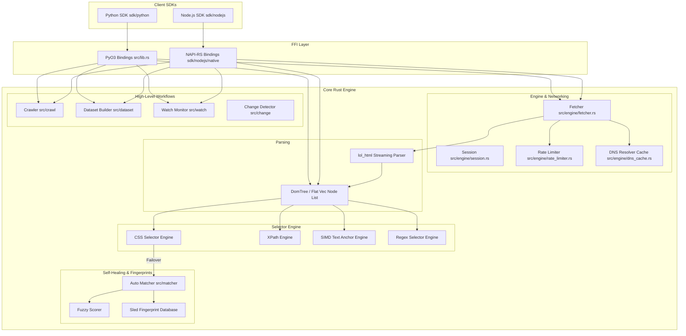

# 01_ARCHITECTURE.md

## High-Level Architecture Diagram

---

## Lifecycles

### 1. Request Lifecycle
When a request is initiated (e.g. `Page::new` in Python or `fetch_page` in Node.js):
1. **FFI Call:** The client script calls Python's `PyPage` constructor or Node's `fetch_page` native function.
2. **Parameters Extraction:** Proxy, headers, cookies, rate limits, and stealth tier are extracted.
3. **DNS Resolution & Caching:** Hostname is queried. The request hits `DnsCacheResolver` (backed by hickory-resolver and moka) to avoid repeated DNS queries.
4. **Rate Limiting:** The hostname is evaluated against `HostRateLimiter` using token bucket limits from the `governor` crate. If a limit is exceeded, the request asynchronously yields.
5. **Connection & Request:** The `wreq` client opens or reuses a connection. If the tier is set to `FetcherTier::Stealthy`, browser headers/JA3 fingerprint/user-agent profiles are applied.
6. **Streaming & Parse:** The response body bytes stream in. Rather than buffering the entire HTML page, bytes are passed directly into `lol_html::HtmlRewriter` or a similar stream parser to build a flat list of `DomNode` elements.
7. **Tree Construction:** A flat `DomTree` vector-indexed representation is returned.

### 2. Crawl Lifecycle
1. **Initialization:** The user instantiates `Crawler` (`PyCrawl` / `JsCrawl`) with target URLs, depth, concurrency, rate limits, and optional selector heuristics.
2. **Queueing:** Root URLs are loaded into the request scheduler.
3. **Worker Pool Spawning:** The crawler spins up worker loops using a Tokio `JoinSet`.
4. **Processing Loop:**
   - Worker pops next URL.
   - Crawls URL using a localized `Fetcher`.
   - Parses the HTML to generate a `DomTree`.
   - Extracts anchor `a[href]` links via CSS selector parsing.
   - Resolves relative URLs.
   - Enqueues unvisited URLs (keeping track of visited links in a concurrent hash set).
   - Reports crawler progress/results back to caller.
5. **Completion:** Returns a set of crawled pages once the queue is empty or limits (depth/max pages) are met.

### 3. Parser Lifecycle
1. **HTML Stream:** Streaming bytes enter the parsing stage.
2. **Tokenization:** `lol_html` tokenizes elements, tags, classes, and text.
3. **Flat Tree Insertion:** The engine builds a flat `DomTree` (`Vec<DomNode>`).
   - Every node is inserted into a continuous vector.
   - Instead of nested child references, child/parent relationships are maintained via indices (`usize`).
   - This eliminates complex pointer trees and memory reference cycles in Rust.
4. **Index Caches:** Classes, IDs, and tag mappings are indexed for rapid lookups.

### 4. Dataset Lifecycle
1. **Schema Definition:** The user defines a schema consisting of fields, selector types (CSS/XPath/Text), selector queries, and value transformations.
2. **Page Loading:** Pages are provided to the dataset builder.
3. **Extraction:**
   - The engine attempts selector query evaluation.
   - If selector fails to return a match and `auto_match` is enabled, the auto-matcher queries `FingerprintStore` to find matching ancestor elements.
   - Extracted text is modified via custom pipeline hooks (e.g. whitespace stripping, capitalization change).
4. **Aggregation:** Results are structured into rows.
5. **Exporting:** Data is converted into Arrow RecordBatches, then written to JSON, CSV, or Parquet.

### 5. Watch Lifecycle
1. **Registration:** A watch structure (`PyWatch` / `JsWatch`) is created targeting a URL, interval, and selector query.
2. **Polling Loop:** A background Tokio task runs periodically (handling cancellation tokens).
3. **Fetch & Parse:** On every tick, the URL is fetched and parsed.
4. **Selector Execution:** The target selector is executed, and a DOM fingerprint of the matched element is computed (xxhash64).
5. **Change Detection:** The calculated fingerprint is compared to the stored fingerprint in `FingerprintStore` (sled).
6. **Notification:** If changes (structural, text, attributes) are detected, a change event is emitted.

---

## SDK Architecture & Module Responsibilities

### Folder Responsibilities
- `src/engine/`: Logic for stealth fetching, DNS caching, connection pooling, and host-level rate limiting.
- `src/parser/`: Logic for streaming HTML parsing and raw `DomTree` structures.
- `src/selector/`: Selectors implementing CSS, XPath, Regex, and SIMD text anchor matches.
- `src/matcher/`: Intelligent selector healing using DOM similarity scoring.
- `src/fingerprint/`: DOM structure calculation and database persistence.
- `src/crawl/`: Orchestrates high-concurrency crawling.
- `src/dataset/`: Constructs and exports tabular datasets to CSV/JSON/Parquet.
- `src/watch/`: Automated site monitors.
- `sdk/python/`: Python package wrapper.
- `sdk/nodejs/`: Node.js napi-rs package.

### Ownership Model
- **DOM Structure:** The `DomTree` owns the flat vector of `DomNode` structures. `PyPage`/`JsPage` share ownership of the `DomTree` via `Arc<DomTree>`.
- **References:** Elements refer to their source tree and their position using `node_index: usize`. This makes element references thin and cloneable without copying the raw string HTML or DOM.
- **Sessions:** Session configuration resides in `Arc<Session>` with interior mutability secured by thread-safe `RwLock` or `Atomic` wrappers.

### Error Propagation
- The Rust engine uses the `thiserror` crate to define `CrawlingoError`.
- All sub-modules return a `Result<T, CrawlingoError>`.
- At the FFI boundary:
  - **Python:** `CrawlingoError` translates into Python-level exceptions (e.g., `PyValueError`, `PyConnectionError`, `PyRuntimeError`) using customized error translation helper functions.
  - **Node.js:** Native JS errors are thrown using `napi::Error` wrappers with error codes.
