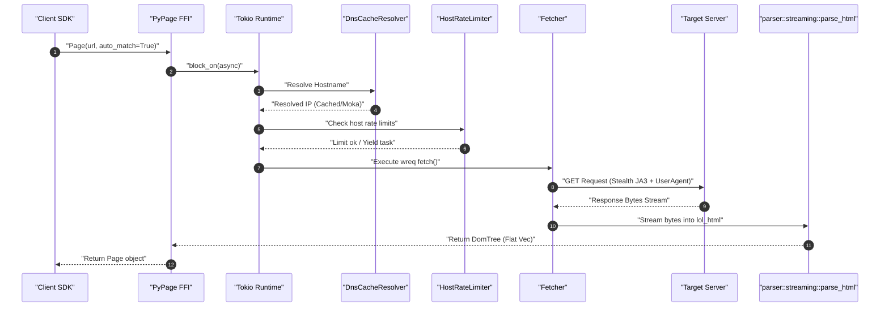

# 03_ENGINEERING_AUDIT.md

This document presents a deep engineering audit of the Crawlingo codebase.

---

## 1. High-Level Architecture & Modules

Crawlingo consists of a core Rust engine and two FFI SDK binding layers:
1. **Core Rust Engine:** Combines networking, raw HTML stream parsing, a flat vector representation of DOM nodes, similarity-based auto-matcher scoring, and tabular export formats (JSON, CSV, Parquet).
2. **Python Wrapper SDK (`sdk/python`):** Uses PyO3 bindings with Maturin build scripts. Exposes a Pythonic API with pre/post lifecycle hooks, an MCP SSE server, and a developer CLI.
3. **Node.js Wrapper SDK (`sdk/nodejs`):** Uses NAPI-RS bindings. Implements native JS class wrappers and custom async tasks that delegate to the core Rust library.

---

## 2. Component Directory Analysis

### `src/engine/`
- **Role:** Handles transport configuration, HTTP retries, user-agent profiles, session state, DNS caches, and request rate-limiting.
- **Connections:** Fetcher is imported by `crawler` and `dataset::builder` to make calls.
- **Audit:** There is no common `Fetcher` trait. The concrete `Fetcher` struct is initialized inline multiple times.

### `src/parser/`
- **Role:** Translates raw response bytes into a tree of nodes.
- **Connections:** DomTree is consumed by the FFI bindings and used by selectors.
- **Audit:** Excellent. Using a flat vector `Vec<DomNode>` with indices instead of reference-counted pointer structures avoids memory allocation cycles and keeps traversals clean in Rust.

### `src/selector/`
- **Role:** Matches nodes inside the DomTree using CSS selectors, XPath queries, SIMD-based text searches, or Regex patterns.
- **Connections:** Evaluated on DomTree elements. Used during data extraction in datasets.
- **Audit:** Selectors are cached in a thread-safe `DashMap` to prevent recompiling. Good performance.

### `src/matcher/` and `src/fingerprint/`
- **Role:** Fingerprints elements to self-heal failed CSS selectors using similarity scoring.
- **Connections:** Invoked by dataset extraction pipelines when static CSS selectors fail. Caches fingerprints in Sled.
- **Audit:** Uses Jaro-Winkler, Jaccard similarity, and hierarchy depth scoring. Uses Rayon to evaluate candidates in parallel.

### `src/dataset/`
- **Role:** Formulates raw extracted data into structured formats (CSV, Parquet, JSON).
- **Connections:** Uses FFI layers for export.
- **Audit:** Parquet export uses Apache Arrow. However, Node.js and Python duplicate some JSON/CSV serialization wrappers.

---

## 3. Detailed File-by-File Evaluation

| File | Purpose | Responsibilities | Caller / Dependent | Recommendations |
| :--- | :--- | :--- | :--- | :--- |
| `src/lib.rs` | Entry point | Launches PyO3 module | Python maturin build | Clean up PyPage implementation to separate FFI from Core logic. |
| `src/engine/fetcher.rs` | HTTP Fetcher | Network execution | PyPage, Crawler, Dataset | Introduce a `Fetcher` trait to mock HTTP requests in testing. |
| `src/engine/session.rs` | Session Management | Proxy pools, cookies, state | Crawler, FFI wrapper | Make sessions thread-safe and reusable across Crawler worker loops. |
| `src/engine/rate_limiter.rs` | Rate Limiter | Host level limit enforcement | Fetcher | Ensure RateLimiter instance is shared, not instantiated per request. |
| `src/parser/document.rs` | Flat DOM Tree | DomTree & DomNode definition | Selectors, FFI wrappers | Well structured. Keep flat vector approach. |
| `src/parser/streaming.rs` | HTML Parser | lol_html parser wrapper | PyPage, Crawler | Retain streaming structure. |
| `src/matcher/auto_matcher.rs` | Healing selector | Similarity matching | Dataset builder | Move configuration values out of hardcoded constants. |
| `src/queue/request_queue.rs` | Priority Queue | SegQueue priority queue | Unused | **Remove or integrate.** This is dead code. |

---

## 4. Request Lifecycle: `Page::fetch(url)` Execution Flow

---

## 5. Brutally Honest Project Evaluation Scores

### Architecture: `5 / 10`
- **Why:** Good core concepts (such as the flat index-based DomTree), but poor separation of concerns. The `Fetcher` and `HostRateLimiter` instances are recreated on every crawler work loop and dataset call, which breaks connection reuse and breaks global rate limiting.

### Maintainability: `5 / 10`
- **Why:** The FFI layer contains significant duplication. The Node.js bindings (`sdk/nodejs/native/src/lib.rs`) duplicate the structures and functions mapped in the Python PyO3 modules, making API updates tedious.

### Readability: `7 / 10`
- **Why:** Code is well organized. Functions are clear, variables are named appropriately, and module boundaries are easily identifiable.

### Performance: `7 / 10`
- **Why:** Leverages low-level optimizations: `lol_html` for streaming parsing, `memchr` SIMD for text search, `Rayon` for parallel similarity scoring, and Apache Arrow/Parquet for export. However, lack of HTTP client reuse hurts performance in multi-request workflows.

### Scalability: `5 / 10`
- **Why:** The crawler relies on simple queue loops without backpressure or stream-based memory controls. Large dataset extraction loads full page vectors in memory instead of utilizing streaming pipelines.

### Testing: `4 / 10`
- **Why:** No mocks or stubs. The integration tests rely entirely on loading static offline HTML files. There are no tests verifying real async workflows in Node.js or Python under networking loads.

### Documentation: `3 / 10`
- **Why:** Lacked detailed design plans, internal diagrams, developer manuals, or architectural guidelines until this documentation suite.

### Production Readiness: `4 / 10`
- **Why:** Lacks telemetry, tracing spans, or metrics exports. The embedded Sled fingerprint store is opened and closed per dataset extraction call, which is a major database bottleneck.

### Open-Source Readiness: `6 / 10`
- **Why:** Code is clean and builds across platform targets with clear CI/CD. However, it lacks clear contribution instructions, developer guidelines, or an API design handbook.
