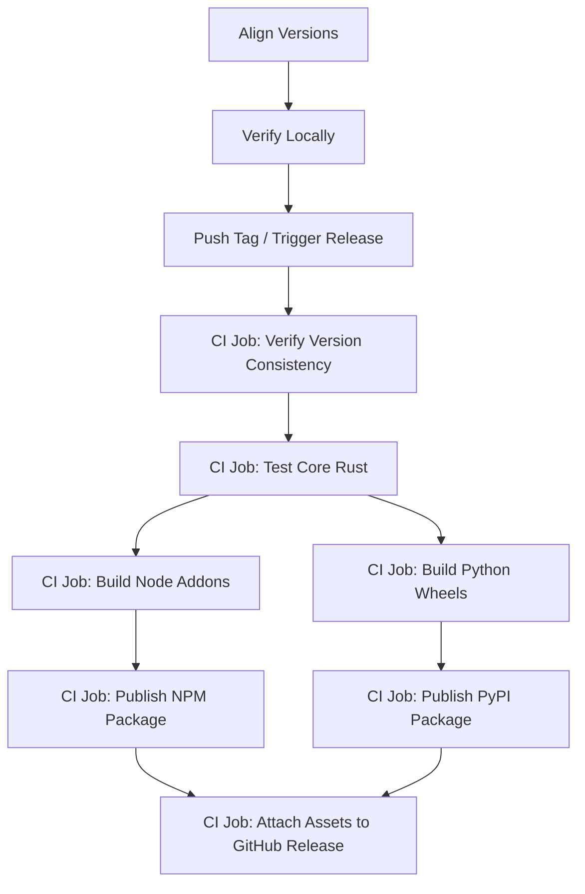

# 09_RELEASE_GUIDE.md

This document outlines the step-by-step process for preparing, testing, and executing a production release of Crawlingo.

---

## 1. Release Lifecycle Workflow



---

## 2. Release Steps

### Step 1: Version Alignment
The release pipeline requires absolute version consistency. You must align the version string in the following three locations before initiating a release:
1. **Rust Core:** `version` in [Cargo.toml](file:///d:/Scraper/Cargo.toml)
2. **Python SDK:** `version` in [sdk/python/pyproject.toml](file:///d:/Scraper/sdk/python/pyproject.toml)
3. **Node.js SDK:** `"version"` in [sdk/nodejs/package.json](file:///d:/Scraper/sdk/nodejs/package.json)

*Note: The CI pipeline will fail at the first stage if there is any mismatch between these files.*

### Step 2: Verification Checklist
Before triggering the release, run the following validation scripts:
```bash
# Verify Rust tests pass
cargo test --workspace

# Test python maturins
cd sdk/python
pip install -e . --no-build-isolation
python -c "from crawlingo import Page; p = Page('https://example.com'); print(p.title())"

# Test nodejs compilation
cd ../nodejs
npm ci
npm run build
npm test
```

### Step 3: Triggering the Release
Create and push a Git tag matching the target version:
```bash
git tag -a v0.1.0 -m "Release version 0.1.0"
git push origin v0.1.0
```
This triggers the `.github/workflows/release.yml` GitHub Action.

---

## 3. GitHub Action Release Jobs

1. **Verify Version Consistency (`verify-version`):** Automatically extracts and matches the version strings from `Cargo.toml`, `pyproject.toml`, and `package.json`.
2. **Test Core (`test-core`):** Runs the full Rust test suite across Ubuntu, macOS, and Windows runners. Runs a python maturin build validation checks.
3. **Build Node Addons (`build-node-addons`):** Compiles the native `.node` addons for the following cross-compiled targets:
   - `x86_64-unknown-linux-gnu`
   - `x86_64-apple-darwin`
   - `aarch64-apple-darwin`
   - `x86_64-pc-windows-msvc`
4. **Build Python Wheels (`python-wheels`):** Builds Python wheels using `cibuildwheel` for target platform and Python versions (running Linux builds using QEMU to cross-compile architecture wheels).
5. **Publish NPM Package (`publish-npm`):** Downloads the prebuilt `.node` addons, executes packaging steps, and publishes the package to NPM registry using OIDC provenance credentials.
6. **Publish Python Package (`publish-python`):** Bundles wheels, builds source distribution packages via `maturin sdist`, and publishes to PyPI.
7. **Attach Assets (`softprops/action-gh-release`):** Automatically uploads Node.js tarballs and Python wheels as downloadable assets on the GitHub Release page.
