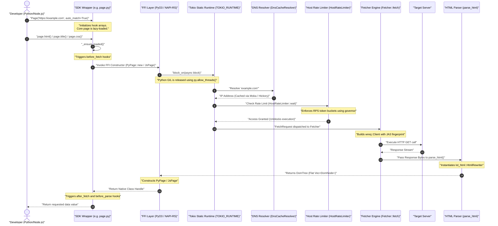

# document/21_EXECUTION_FLOW.md

This document traces the exact step-by-step code execution flow of Crawlingo when fetching a web page.

---

## 1. Execution Flow Diagram

---

## 2. Transition-by-Transition Walkthrough

### Transition 1: User to SDK Wrapper
- **Module:** `sdk/python/crawlingo/page.py` or Node.js equivalent.
- **Action:** User instantiates `Page(url)`. The wrapper class does not immediately hit the network; it stores configuration options and initializes user hooks (`before_fetch`, `after_fetch`, `before_parse`, `after_extract`).
- **Trigger:** Accessing any property (like `.html()`, `.title()`, or `.css()`) invokes `_ensure_loaded()`.

### Transition 2: SDK Wrapper to FFI Layer
- **Module:** `src/lib.rs` (PyO3 `PyPage`) or `sdk/nodejs/native/src/lib.rs` (NAPI-RS).
- **Action:** Coordinates FFI type conversion. Extracts standard parameters (URL, timeout, proxy, headers, cookies).
- **GIL Release:** Python calls wrap execution blocks in `py.allow_threads(...)`. This releases Python's Global Interpreter Lock, preventing CPU starvation in the Python interpreter while waiting on the network.
- **Ownership:** Python-owned strings are cloned into Rust heap-allocated `String` structures.

### Transition 3: FFI Layer to Async Runtime Boundary
- **Module:** `src/lib.rs` (global `TOKIO_RUNTIME`).
- **Action:** The wrapper executes `TOKIO_RUNTIME.block_on(async { ... })`. This blocks the FFI thread synchronously while running the network futures on Tokio's multi-threaded worker pool.
- **Node.js variation:** Node.js napi-rs handles async tasks natively, spawning them directly on the Tokio task loop and returning a Javascript Promise rather than blocking the main event thread.

### Transition 4: DNS Resolution & Caching
- **Module:** `src/engine/dns_cache.rs` (`DnsCacheResolver`).
- **Action:** Resolves the target host. It queries the Hickory resolver, caching results inside a thread-safe `moka` cache to eliminate recurrent name resolution round-trips.

### Transition 5: Rate Limiting
- **Module:** `src/engine/rate_limiter.rs` (`HostRateLimiter`).
- **Action:** The client queries rate limit configurations per hostname. Uses the `governor` crate. If request volumes exceed limits, the task asynchronously yields (`sleep`), resolving only when the token bucket refills.

### Transition 6: Fetcher Transport Execution
- **Module:** `src/engine/fetcher.rs` (`Fetcher::fetch`).
- **Action:** Instantiates `wreq::Client::builder()`. Configures proxy routers, idle timeouts, and connection pool configs.
- **Stealth profile:** If `tier` matches `FetcherTier::Stealthy`, applies JA3 client fingerprints and user-agent emulation headers (Chrome, Firefox, or Safari).
- **Retries:** Executes HTTP request in a loop. If connection time-outs or resets occur, sleeps with exponential backoff before retrying.

### Transition 7: HTML Stream Parsing
- **Module:** `src/parser/streaming.rs` (`parse_html`).
- **Action:** Ingests raw response bytes streamingly into `lol_html::HtmlRewriter`.
- **DOM Compilation:** Emits tag tokenizer events. Builds parent-child links in a flat vector `Vec<DomNode>`.
- **Text accumulation:** Accumulates text nodes under active stack element parent IDs.

### Transition 8: Returned to SDK
- **Module:** `src/lib.rs` (`PyPage`).
- **Action:** Wraps the compiled `DomTree` in an atomic pointer (`Arc<DomTree>`) and instantiates the `PyPage` wrapper, returning it across the FFI boundaries.
- **Hooks execution:** Python triggers `after_fetch`, modifies raw HTML via `before_parse` filters, and exposes the completed `Page` object.
