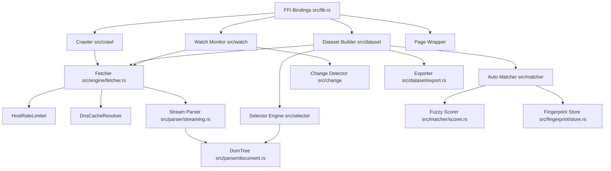

# document/23_MODULE_DEPENDENCY.md

This document maps the dependencies between Crawlingo's internal modules and evaluates architectural coupling risks.

---

## 1. Internal Module Dependency Graph

---

## 2. Forbidden Boundaries (Should Never Happen)

To preserve maintainability, the following module dependencies are strictly prohibited:
1. **DomTree / Selectors must never depend on the Fetcher:** Elements and selector engines are purely computational and must remain network-agnostic.
2. **AutoMatcher / Scorer must never depend on FFI Layers:** The matching algorithm must run in pure Rust without references to PyO3's GIL or Node.js napi engines.
3. **Change Detector must never depend on the Database Store:** The detector should only evaluate structural modifications between two `Page` objects. It is the caller's (e.g. `Watch`) responsibility to read/write fingerprints to Sled.

---

## 3. Coupling Analysis & Dependency Audit

### Circular Dependencies
- **Result:** **No compiler-level circular dependencies detected.** Rust's compiler enforces strict acyclic module boundaries at build time.
- **Gotcha:** There is implicit conceptual circularity in FFI wrapper dependencies:
  - `src/lib.rs` depends on `dataset::builder` and `crawl::crawler`.
  - `dataset::builder` and `crawl::crawler` instantiate fetcher engines inline that depend on `session` attributes.
  - Updating session FFI bindings requires updating FFI mappings in the entrypoint.

### Unnecessary / Dead Dependencies
1. **`src/queue/request_queue.rs` is dead code:** It compiles but is never imported or used by any engine runner.
2. **`pyo3` imports in `dataset/builder.rs`:**
   - The `DatasetField` uses `transform: Option<pyo3::PyObject>` guarded behind the `#[cfg(feature = "python")]` feature flag.
   - This ties core Rust serialization structures to Python FFI dependencies.

---

## 4. Suggested Refactoring Improvements

1. **Delete `request_queue.rs`:** Immediately clean up compiling targets.
2. **Decouple Python Transforms:** Remove `Option<PyObject>` from the core `DatasetField` structure. Handle data transformations in the Python wrapper layer (`sdk/python/crawlingo/dataset.py`) instead of the Rust core.
3. **Refactor FFI Module Isolation:** Move FFI binding targets out of `src/lib.rs` into a clean subfolder: `src/ffi/python.rs` and `src/ffi/nodejs.rs` to isolate the Rust core from language bindings.
4. **Decouple the Fetcher:** Pass the fetcher as a trait boundary to the Crawler and Dataset builders rather than letting them instantiate client connections inline.
