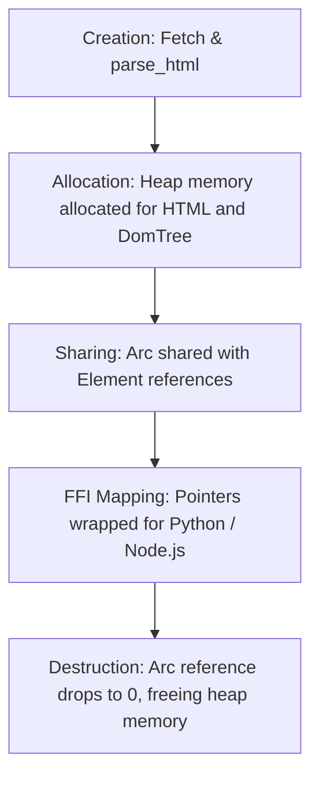

# document/24_PAGE_MODEL.md

This document presents a detailed breakdown of the `Page` object, its fields, memory lifecycle, and FFI API boundaries.

---

## 1. Page Model Internals

### Fields
- `url` (String): The fully resolved target URL.
- `status` (u16): The HTTP status code of the response.
- `html` (String): The raw HTML string.
- `tree` (`Arc<DomTree>`): The flat, vector-based DOM tree representation.

### Methods
- `.html()` -> returns raw string HTML content.
- `.title()` -> returns `<title>` tag content.
- `.css(selector)` -> returns `ElementCollection` matched by CSS.
- `.xpath(query)` -> returns `ElementCollection` matched by XPath.
- `.find_text(text)` -> returns `ElementCollection` of nodes containing exact text.
- `.after_text(text)` -> returns `ElementCollection` following a text anchor.
- `.before_text(text)` -> returns `ElementCollection` preceding a text anchor.
- `.regex(pattern)` -> returns `ElementCollection` matching regex pattern.

---

## 2. Memory Lifecycle & Ownership

### Creation
- A Page is created after a successful fetch strategy executes.
- `parse_html` processes the HTML bytes, allocates the contiguous `DomTree` vector on the Heap, and returns the constructed `Page` instance.

### Modification (Immutable Design)
- The Page object is designed to be **immutable** after creation.
- Once the HTML is parsed and the flat `DomTree` is allocated, its structures cannot be modified. This ensures thread-safety across concurrent workers.

### Destruction
- When the `Page` instance is dropped, the reference count of the `Arc<DomTree>` decrements.
- When the count reaches `0`, the allocated vector space is cleared from the heap.

---

## 3. Scope Boundaries: What Belongs vs. What Does Not

### What Belongs on `Page`
- Direct operations on the DOM tree (e.g. `.css()`, `.xpath()`, `.links()`, `.text()`).
- Because these methods require access to the parsed DOM tree structure, implementing them directly on the `Page` struct avoids exposing raw DOM pointers to the FFI wrappers.

### What Should NOT Belong on `Page`
1. **Network transport methods (like `page.reload()` or `page.save()`):** The Page struct represents an immutable document snapshot. It should not be responsible for executing HTTP queries or managing connection sockets. Network logic should reside exclusively in the `FetchManager` and strategy modules.
2. **Tabular write logic (`page.to_parquet()`):** Storing data is the responsibility of the `Dataset` exporter module. Page should remain clean of serialization dependencies (like Arrow or Parquet).
