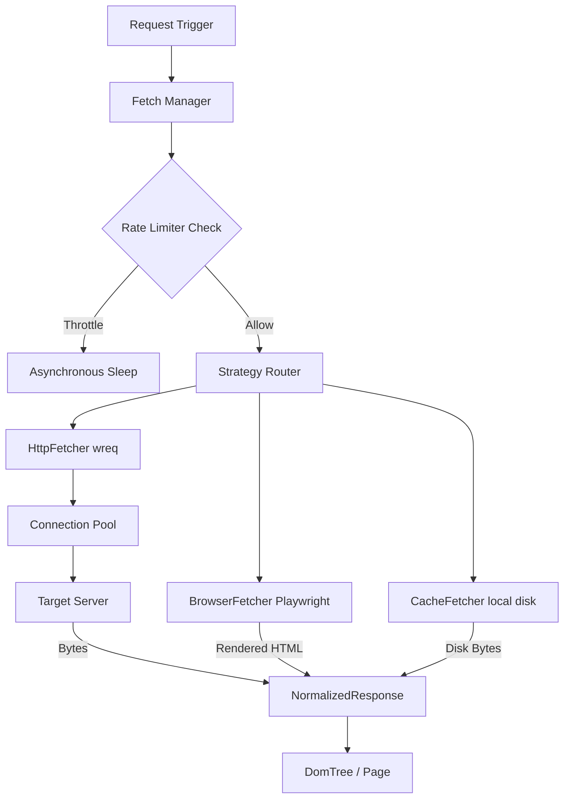

# document/25_FETCH_PIPELINE.md

This document reverse-engineers the network transport, session management, and rate-limiting structures in Crawlingo.

---

## 1. Fetch Engine Architecture Diagram



---

## 2. Component Design Breakdown

### Request Builder
The request configurations are built using `FetchRequest` properties:
- **`url`:** Target endpoint.
- **`tier`:** standard request or stealth-impersonation mode.
- **`browser_profile`:** Configures Firefox, Safari, or Chrome emulations.
- **`headers` / `cookies`:** Appended key-value pairs.
- **`proxy`:** Route path (supports user:pass authentication).
- **`timeout`:** Exceeding duration cancels connection.
- **`retries`:** Loop limits for network resets.

### Fetch Manager (`FetchManager`)
Responsible for executing request lifecycles.
- Resolves DNS targets using `DnsCacheResolver` to bypass standard network lookups.
- Enforces requests-per-second limits using token buckets (`governor` crate).
- Implements exponential retry backoffs for failed connection tasks.

### Core Strategies

#### 1. HTTP Fetcher
Uses the `wreq` client wrapper. If the stealth tier is selected, it configures:
- TLS JA3 client fingerprints.
- ALPN negotiation parameters.
- User-agent headers matching selected browser profiles.

#### 2. Browser Fetcher
Launches headless browser subprocesses (via Playwright or Chrome DevTools interface) to render dynamic pages, execute dynamic JS, and extract the fully hydrated HTML body.

#### 3. Session Manager (`Session`)
Coordinates authentication states across requests. Stores cookie jars and shared headers inside thread-safe `RwLock` wrappers, rotation indices for proxy lists, and global rate limiter states.

#### 4. Cache Fetcher
Checks local database stores (such as a directory path or sled DB table). If a cached response is present and valid, returns it directly, bypassing outgoing network requests.

---

## 3. Retries, Timeouts & Error Mapping

- **Timeouts:** `timeout(Duration)` is configured on the `wreq::ClientBuilder`. If the connection, handshake, or download duration exceeds this limit, a timeout error is raised.
- **Retry Backoff:** Retriable network errors (e.g. DNS resolutions failures or reset sockets) trigger backoff loops:
  ```rust
  let mut delay = Duration::from_millis(500);
  // On each retry, delay is multiplied by 2 (exponential backoff)
  ```
- **Error Normalization:** Errors are mapped from crate-specific errors (`wreq::Error`, `std::io::Error`) into unified `CrawlingoError` variants.
