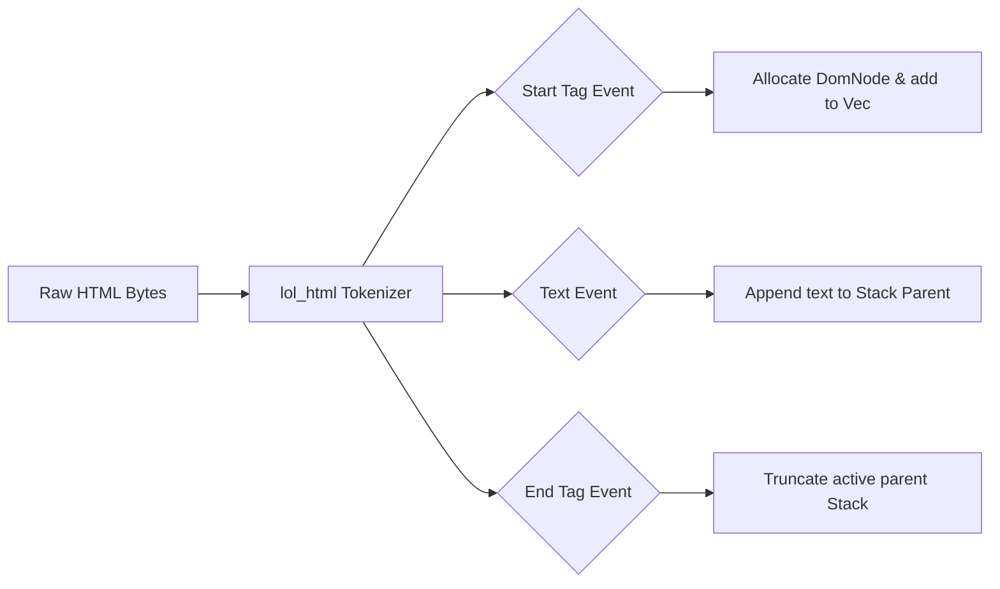

# document/26_PARSER_PIPELINE.md

This document maps how raw HTML bytes are processed streamingly and converted into a flat vector DOM representation.

---

## 1. HTML Ingestion & Streaming Parse



### Stream parsing via `lol_html`
Rather than loading the entire HTML document into a string buffer before building the tree, Crawlingo streams the response bytes directly into `lol_html::HtmlRewriter`.
1. **Element Handlers:** A wildcard selector handler `element!("*", ...)` intercepts all tag parsing events.
2. **Document Text Handlers:** A document text handler `doc_text!(...)` captures raw text strings between tags.

---

## 2. Flat Vector DOM Allocation (`DomTree`)

Instead of standard nested tree architectures (which compile child elements as lists of smart pointers `Rc<RefCell<DomNode>>`), Crawlingo stores the DOM as a flat contiguous array:

```rust
pub struct DomTree {
    pub nodes: Vec<DomNode>,
}
```

### Relationship Indexing
- **Indices:** Parent, child, and sibling relationships are recorded using `usize` integers.
- **Node Insertion:** When a tag is encountered, the engine allocates a new `DomNode` and pushes it to the vector:
  ```rust
  let new_idx = self.nodes.len();
  node.index = new_idx;
  // Push index to parent's children list
  if let Some(parent_idx) = node.parent {
      self.nodes[parent_idx].children.push(new_idx);
  }
  ```
- **Advantages:** Continuous vectors avoid reference cycles, eliminate memory fragmentation, and fit efficiently inside CPU cache lines.

---

## 3. Selector Execution & Extraction Logic

### CSS Selectors
The engine splits selector queries (e.g. `div.product h1`) by whitespace to compile selector groups.
- Leaf nodes are checked against the final selector group.
- If a match is found, the engine traverses the parent indices recursively to check if ancestors match the remaining groups.

### Core Data Extraction Helpers
- **Text Extraction:** Iterates through the element and recursively gathers text values from all children, trimming whitespace and appending spaces between adjacent nodes.
- **Links (`a[href]`):** Scans the DOM tree for `a` tags containing `href` attribute keys and resolves absolute paths using the page's base URL.
- **Images (`img[src]`):** Extracts `img` elements, returning alt tags and image paths.
- **Metadata Extraction:** Queries header `meta` tags (such as `og:title` or `twitter:card`) and JSON-LD blocks to compile structural page descriptions.
