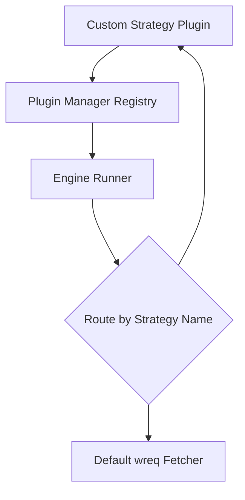

# document/29_PLUGIN_SYSTEM.md

This document analyzes the current extensibility of Crawlingo and designs a modular plugin architecture to support dynamic fetchers, custom parsers, and custom storage engines.

---

## 1. Current State: Is Crawlingo Pluggable?

Currently, **Crawlingo is not pluggable**.
- Fetchers, rate limiters, and exporters are implemented as concrete structs rather than abstract traits.
- The Python wrapper uses callbacks (hooks), which allow users to run hooks before/after fetches but do not support replacing core engine operations like the parser or database storage.

---

## 2. Redesigned Trait Hierarchies

To make Crawlingo pluggable, we define traits for all core components:

```rust
// 1. Fetcher Strategy Plugin
pub trait FetchStrategy: Send + Sync {
    fn name(&self) -> &str;
    fn fetch<'a>(&'a self, req: &'a FetchRequest) -> BoxFuture<'a, Result<NormalizedResponse, CrawlingoError>>;
}

// 2. Parser Plugin
pub trait DocumentParser: Send + Sync {
    fn name(&self) -> &str;
    fn parse(&self, bytes: &[u8]) -> Result<DomTree, CrawlingoError>;
}

// 3. Exporter Plugin
pub trait DatasetExporter: Send + Sync {
    fn name(&self) -> &str;
    fn export(&self, results: &[DatasetResult], output_path: &str) -> Result<(), CrawlingoError>;
}

// 4. Fingerprint Storage Plugin
pub trait StorageBackend: Send + Sync {
    fn name(&self) -> &str;
    fn save_fingerprint(&self, key: &str, fingerprint: &DomFingerprint) -> Result<(), CrawlingoError>;
    fn load_fingerprint(&self, key: &str) -> Result<Option<DomFingerprint>, CrawlingoError>;
}
```

---

## 3. Registration & Dynamic Loading Architecture



We introduce a central `PluginRegistry` to manage strategy plugins:

```rust
pub struct PluginRegistry {
    fetch_strategies: DashMap<String, Arc<dyn FetchStrategy>>,
    parsers: DashMap<String, Arc<dyn DocumentParser>>,
    exporters: DashMap<String, Arc<dyn DatasetExporter>>,
    storage: Arc<dyn StorageBackend>,
}

impl PluginRegistry {
    pub fn register_fetch_strategy(&self, strategy: Arc<dyn FetchStrategy>) {
        self.fetch_strategies.insert(strategy.name().to_string(), strategy);
    }
}
```

### Dynamic Loading (DLLs)
For compiled deployments, plugins can be loaded dynamically at runtime using Rust's `libloading` crate to load dynamic library modules (`.so`, `.dll`, or `.dylib`):

```rust
pub unsafe fn load_external_plugin(path: &str, registry: &mut PluginRegistry) -> Result<(), CrawlingoError> {
    let lib = libloading::Library::new(path)
        .map_err(|e| CrawlingoError::ConfigurationError(format!("Failed to load plugin lib: {}", e)))?;
    
    let register_fn: libloading::Symbol<unsafe extern "C" fn(&mut PluginRegistry)> = lib.get(b"register_plugin")
        .map_err(|e| CrawlingoError::ConfigurationError(format!("Failed to load register symbol: {}", e)))?;
        
    register_fn(registry);
    // Keep library reference alive in memory
    std::mem::forget(lib);
    Ok(())
}
```
This allows developers to extend the engine with custom plugins without recompiling Crawlingo's core binary.
