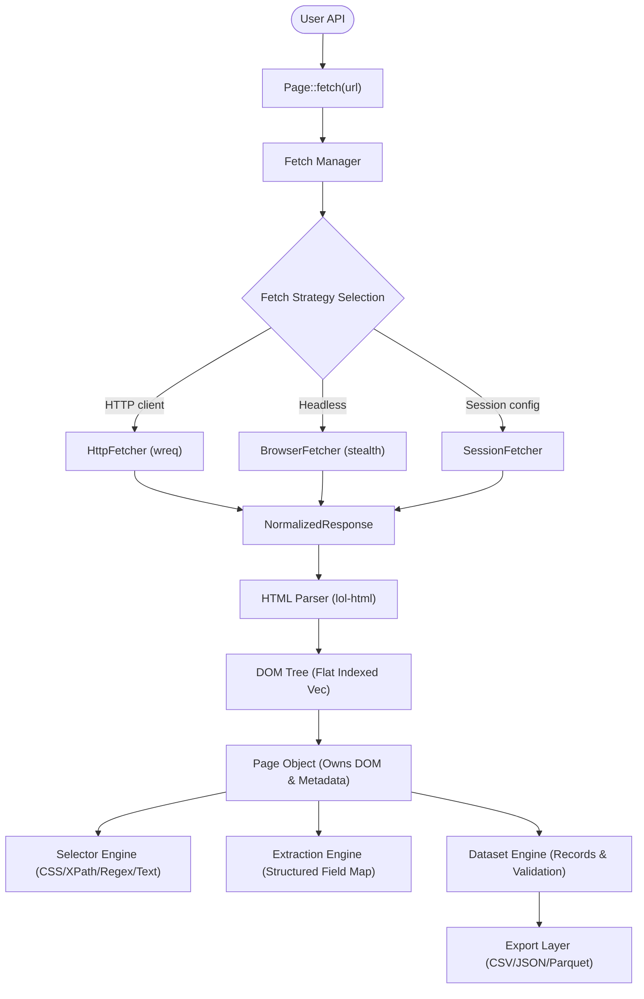

# docs/CORE_ARCHITECTURE.md

This document outlines the proposed target core architecture for Crawlingo. The new design shifts Crawlingo from a coupled procedural scraper to a highly modular, decoupled, and thread-safe Web Data Engine centered around the `Page` object.

---

## 1. High-Level Core Flow Diagram

---

## 2. Layer-by-Layer Architecture

### A. User API / Entry Point
- **Purpose:** Simple entry point for Python, Node.js, and native Rust. The primary interface is `Page::fetch(url)`.
- **Ownership:** The user owns the config/session and receives ownership of the compiled `Page` struct.

### B. Fetch Manager & Fetch Strategies
- **Purpose:**
  - **Fetch Manager:** Acts as the traffic controller for all network traffic. It evaluates request parameters, routes them to the correct strategy, and handles pacing, timeouts, and retries.
  - **Fetch Strategy Trait:** Decouples the engine from concrete networking clients. Strategies like `HttpFetcher` (standard HTTP client) and `BrowserFetcher` (impersonated or headless fetcher) implement the same trait interface.
- **Why it exists:** Allows dynamic swapping of network backends (e.g. mock fetchers during testing or rotating stealth engines) without changing downstream parsing code.

### C. Normalized Response
- **Purpose:** A single, consistent data transfer object containing:
  - `status`: u16 HTTP status code.
  - `headers`: Map of string headers.
  - `cookies`: Map of string cookies.
  - `body`: Raw byte body (`bytes::Bytes`).
  - `content_type` & `encoding`: Charset/content-type flags.
  - `timings`: Response metrics (e.g., DNS, TCP connection, TLS handshake).
  - `final_url`: The URL after following redirects.
- **Why it exists:** Standardizes input formats. The parser only consumes `NormalizedResponse` and does not care whether the bytes came from a standard GET request, a headless browser, a file cache, or an API gateway.

### D. HTML Parser
- **Purpose:** Consumes `NormalizedResponse`, decodes encodings into UTF-8 safely, and builds the flat-vector indexed DOM tree. It also extracts page metadata (title, scripts, styles, forms, links) during tokenization.
- **Why it exists:** Isolates HTML parsing from network concerns. The parser has exactly one responsibility: compiling bytes and metadata into the DOM representation.

### E. Page Object
- **Purpose:** The heart of the Crawlingo runtime. It owns the raw HTML, the parsed `DomTree`, and pre-compiled page metadata (links, scripts, styles, forms, images).
- **Why it exists:** Acts as the shared immutable state. Once a Page is compiled, it is read-only and thread-safe. All selector, extraction, and dataset engines operate on the Page object.

### F. Selector Engine
- **Purpose:** Traverses the DOM tree inside a Page to find matching nodes using CSS, XPath, Regex, or Text-anchors.
- **Why it exists:** Provides query routing. It only locates nodes (returning index slices) and does not perform data extraction or transformation.

### G. Extraction Engine
- **Purpose:** Converts queried DOM node slices into structured fields (e.g. extracting `title` string, resolving relative links, stripping currency signs).
- **Why it exists:** Translates raw DOM states into domain-specific schemas without knowledge of network channels or output exporters.

### H. Dataset Engine & Exporters
- **Purpose:**
  - **Dataset Engine:** Aggregates extraction results across one or more Page objects, applies validation schemas, deduplicates, and manages pagination records.
  - **Exporter:** Serializes dataset records to CSV, JSON, or Apache Parquet formats.
- **Why it exists:** Ensures data validation, buffering, and file formatting are separated from DOM-parsing or selector execution.

---

## 3. Communication, Ownership, & Flow Details

### A. Ownership Model
- **Request State:** `Session` is shared via `Arc<Session>`.
- **Response Flow:** The `FetchManager` creates and returns a `NormalizedResponse` owning its byte vector.
- **Page Compilation:** The `Parser` consumes the `NormalizedResponse` by value, compiles the `DomTree` (moving bytes), and hands ownership of the resulting `Page` object back to the caller.
- **Immutable Page:** The `Page` is immutable. Selectors and Extraction Engines borrow the `Page` (e.g. `&Page`), allowing multiple threads to query the same Page concurrently.

### B. Async Flow
- The network fetch and headless browser layers are fully asynchronous (`tokio`).
- Once the `NormalizedResponse` is handed to the `Parser`, the compilation of the `DomTree` is CPU-bound. If the page is massive, parsing can be offloaded to a worker thread via `tokio::task::spawn_blocking` to avoid blocking the async reactor.

### C. Thread Safety
- `Session` is thread-safe (`Send + Sync`), protecting state via `RwLock`.
- `Page` implements `Send + Sync` since it contains no raw pointers or interior mutability.
- Rate-limiting uses thread-safe lock-free atomic bucketing (`governor` and `DashMap`), ensuring politeness configurations are shared across all concurrent workers.
