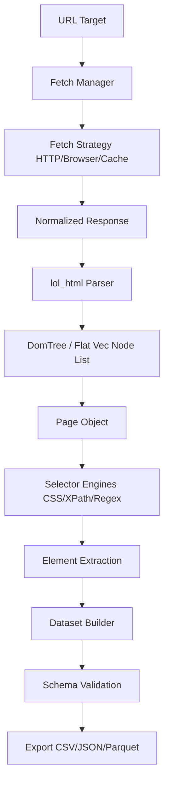

# docs/NEW_ARCHITECTURE.md

This document proposes the redesigned architecture for Crawlingo as a modular, high-performance web data engine.

---

## 1. Redesigned Processing Pipeline



---

## 2. Module Responsibilities & Trait Boundaries

### Fetch Manager (`crawlingo::engine::fetch`)
- **Responsibilities:** Evaluates request configurations, chooses the correct fetch strategy, rotates proxies, resolves cached DNS lookups, and enforces host-level rate limits.
- **APIs:**
  ```rust
  pub struct FetchManager {
      session: Arc<Session>,
      rate_limiter: Arc<HostRateLimiter>,
  }
  
  impl FetchManager {
      pub async fn fetch(&self, req: FetchRequest) -> Result<NormalizedResponse, CrawlingoError>;
  }
  ```

### Fetch Strategy Trait
- **Responsibilities:** Decouples the concrete HTTP client (`wreq`) from rendering strategies, allowing users to plug in custom browser automation tools or mock clients for testing.
- **Signature:**
  ```rust
  pub trait FetchStrategy: Send + Sync {
      fn execute<'a>(&'a self, req: &'a FetchRequest) -> BoxFuture<'a, Result<NormalizedResponse, CrawlingoError>>;
  }
  ```

### normalized Page Object (`crawlingo::parser::Page`)
- **Responsibilities:** Owns the downloaded page context, the raw HTML string, the target URL, the HTTP response status, and the parsed `DomTree`.
- **APIs:**
  ```rust
  pub struct Page {
      pub url: String,
      pub status: u16,
      pub html: String,
      pub tree: Arc<DomTree>,
  }
  
  impl Page {
      pub fn css(&self, selector: &str) -> ElementCollection;
      pub fn xpath(&self, query: &str) -> ElementCollection;
      pub fn text(&self) -> String;
      pub fn markdown(&self) -> String;
      pub fn metadata(&self) -> HashMap<String, String>;
  }
  ```

### Dataset Builder (`crawlingo::dataset`)
- **Responsibilities:** Compiles tabular results using defined schemas. It does *not* execute network fetches; it operates strictly on loaded `Page` objects.
- **APIs:**
  ```rust
  pub struct DatasetBuilder {
      schema: DatasetSchema,
      store: Arc<FingerprintStore>,
  }
  
  impl DatasetBuilder {
      pub fn extract(&self, page: &Page) -> Result<DatasetResult, CrawlingoError>;
  }
  ```

---

## 3. Ownership, Lifetimes & Thread Safety

- **Ownership:** The `Page` struct owns its `url` and `html` string data. The heavy `DomTree` structure is shared via `Arc<DomTree>` to allow concurrent selector evaluations without cloning the underlying vector.
- **Lifetimes:** Elements reference their parent `DomTree` via `usize` index markers, avoiding lifetime references (`'a`) that complicate FFI mappings.
- **Thread Safety:** All core components implement `Send` and `Sync`. Selectors compile and cache patterns inside a thread-safe `DashMap`.
- **Async Boundaries:** Network fetches are async and run in background thread pools. The FFI boundary uses blocking wrappers (`TOKIO_RUNTIME.block_on`) for Python, while Node.js uses native async tasks.
