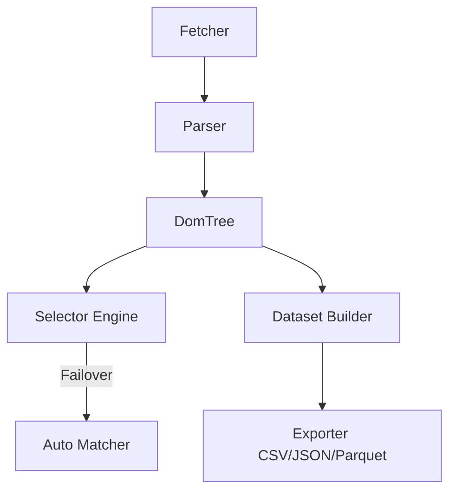

# docs/PROJECT_AUDIT.md

This document presents the complete codebase audit of Crawlingo.

---

## 1. Project Overview

Crawlingo is a high-performance web data engine written in Rust with native wrapper libraries for Python and Node.js. It features a streaming HTML parser, SIMD-accelerated text anchor matching, and self-healing selector scoring backed by an embedded database.

---

## 2. Folder-by-Folder Explanation

- **`src/`**: The core engine of the project, containing the logic for transport fetching, rate limiting, streaming HTML parsing, selector matching, fuzzy healing matchers, dataset creation/export, change detection, and monitor watching.
- **`src/engine/`**: Manages network configurations, client state, rate limiting, connection pools, and DNS resolution caching.
- **`src/parser/`**: Streamingly compiles raw HTML bytes into a flat, vector-based DOM tree representation.
- **`src/selector/`**: Implements selector querying APIs matching elements via CSS, XPath, Regex patterns, or SIMD-accelerated text boundaries.
- **`src/matcher/`**: Executes parallel candidate similarity comparisons to heal broken selectors.
- **`src/fingerprint/`**: Archives DOM element fingerprints inside an embedded `sled` database.
- **`src/crawl/`**: Manages concurrent site crawling loops using Tokio task sets.
- **`src/dataset/`**: Extracts and serializes tabular results to CSV, JSON, and Parquet.
- **`src/watch/`**: Periodically polls web pages to notify callers of structural or content modifications.
- **`src/change/`**: Detects changes (content, price, stock, layout, element additions/removals) over time.
- **`src/queue/`**: Implements priority queues for requests.
- **`sdk/python/`**: Maturin package wrapping the Rust core in a pythonic API. Includes a developer CLI and MCP server.
- **`sdk/nodejs/`**: NAPI-RS project wrapping the Rust core for JavaScript/TypeScript environments.
- **`tests/`**: Contains offline integration and edge-case validation suites.
- **`benches/`**: Houses performance benchmark test definitions.

---

## 3. File-by-File Explanation

### Core Rust Library

#### [lib.rs](file:///d:/Scraper/src/lib.rs)
- **Purpose:** Entry point for Rust crate and PyO3 bindings.
- **Responsibilities:** Configures submodules, instantiates the shared static `TOKIO_RUNTIME`, and registers classes for Python FFI.
- **Who calls it:** Mature build scripts and FFI runtime.
- **Who depends on it:** Python package wrapper.
- **Can it be removed/simplified?** Cannot be removed. Can be simplified by moving the PyPage implementation details to a separate file (e.g. `src/ffi/python.rs`).

#### [error.rs](file:///d:/Scraper/src/error.rs)
- **Purpose:** Central error mapping.
- **Responsibilities:** Implements `CrawlingoError` using the `thiserror` library.
- **Who calls it:** Almost every module in `src/`.
- **Who depends on it:** Node.js/Python FFI layers.
- **Can it be removed/simplified?** Cannot be removed. Already simplified.

#### [engine/fetcher.rs](file:///d:/Scraper/src/engine/fetcher.rs)
- **Purpose:** Network transport executor.
- **Responsibilities:** Dispatches HTTP requests using `wreq` client builders. Handles proxies, headers, cookies, retries, and browser emulation profiles.
- **Who calls it:** `PyPage`, `Crawler`, `Dataset::build_async`.
- **Who depends on it:** Main scraper execution flow.
- **Can it be removed/simplified?** Cannot be removed. It must be simplified by refactoring the `wreq::Client` creation out of the `fetch()` loop so that the client connection pool is reused across calls.

#### [engine/session.rs](file:///d:/Scraper/src/engine/session.rs)
- **Purpose:** Manages scrape session configurations.
- **Responsibilities:** Encapsulates headers, cookies, rotating proxy pools, timeouts, and rate limiting variables behind thread-safe locks (`RwLock`).
- **Who calls it:** FFI modules and dataset builds.
- **Who depends on it:** `crawler.rs`, `builder.rs`.
- **Can it be removed/simplified?** Cannot be removed. Should be simplified by consolidating proxy rotation indexes.

#### [engine/rate_limiter.rs](file:///d:/Scraper/src/engine/rate_limiter.rs)
- **Purpose:** Host request rate-limiter.
- **Responsibilities:** Enforces limit frequencies per domain name using the `governor` crate.
- **Who calls it:** `Fetcher`.
- **Who depends on it:** Connection transport.
- **Can it be removed/simplified?** Cannot be removed. Must be shared rather than recreated per fetch.

#### [engine/pool.rs](file:///d:/Scraper/src/engine/pool.rs)
- **Purpose:** Connection pool settings.
- **Responsibilities:** Holds pool timeouts, keepalive, and limits parameters.
- **Who calls it:** `Fetcher`.
- **Who depends on it:** `wreq` client builders.
- **Can it be removed/simplified?** Can be combined into `fetcher.rs` if needed, but keeping it separate is clean.

#### [engine/dns_cache.rs](file:///d:/Scraper/src/engine/dns_cache.rs)
- **Purpose:** Speeds up DNS resolving.
- **Responsibilities:** Resolves IPs and caches targets using `hickory-resolver` and `moka`.
- **Who calls it:** `Fetcher`.
- **Who depends on it:** Connection transport.
- **Can it be removed/simplified?** Already well structured.

#### [parser/document.rs](file:///d:/Scraper/src/parser/document.rs)
- **Purpose:** DOM tree model definition.
- **Responsibilities:** Maps element relations (parent, child, siblings) inside a flat vector `Vec<DomNode>` (`DomTree`). Exposes FFI element classes.
- **Who calls it:** Selectors, parsing utilities, and FFI wrappers.
- **Who depends on it:** Almost the entire extraction pipeline.
- **Can it be removed/simplified?** Cannot be removed. The flat vector implementation is excellent.

#### [parser/streaming.rs](file:///d:/Scraper/src/parser/streaming.rs)
- **Purpose:** Low-level HTML parser.
- **Responsibilities:** Feeds raw response bytes into `lol_html` to compile the flat `DomTree`.
- **Who calls it:** `Fetcher` processing loops.
- **Who depends on it:** HTML ingestion.
- **Can it be removed/simplified?** Cannot be removed.

#### [selector/css.rs](file:///d:/Scraper/src/selector/css.rs)
- **Purpose:** CSS element matcher.
- **Responsibilities:** Parses and compiles CSS selectors, caching results in a `DashMap`.
- **Who calls it:** `DomTree` selectors, `Dataset` builders, `Crawler`.
- **Who depends on it:** Selector engine.
- **Can it be removed/simplified?** Cannot be removed.

#### [selector/xpath.rs](file:///d:/Scraper/src/selector/xpath.rs)
- **Purpose:** XPath matcher.
- **Responsibilities:** Evaluates raw XPath queries against the flat tree.
- **Who calls it:** `Dataset` builder extraction.
- **Who depends on it:** Selector engine.
- **Can it be removed/simplified?** Cannot be removed.

#### [selector/text_anchor.rs](file:///d:/Scraper/src/selector/text_anchor.rs)
- **Purpose:** Anchor search matcher.
- **Responsibilities:** Implements fast exact or fuzzy text searches using `memchr` SIMD.
- **Who calls it:** Element queries.
- **Who depends on it:** Selector engine.
- **Can it be removed/simplified?** Cannot be removed.

#### [selector/regex_selector.rs](file:///d:/Scraper/src/selector/regex_selector.rs)
- **Purpose:** Regex matcher.
- **Responsibilities:** Evaluates regular expressions against DOM text nodes. Caches regex patterns.
- **Who calls it:** Element queries.
- **Who depends on it:** Selector engine.
- **Can it be removed/simplified?** Cannot be removed.

#### [crawl/crawler.rs](file:///d:/Scraper/src/crawl/crawler.rs)
- **Purpose:** High-concurrency website scraper.
- **Responsibilities:** Launches worker loops using Tokio task sets, keeping track of visited URLs.
- **Who calls it:** FFI `PyCrawl` / `JsCrawl`.
- **Who depends on it:** Client scripts.
- **Can it be removed/simplified?** Cannot be removed. Must be simplified to reuse a shared Session client.

#### [dataset/builder.rs](file:///d:/Scraper/src/dataset/builder.rs)
- **Purpose:** Structured data extraction.
- **Responsibilities:** Extracts schemas, handles fuzzy selector auto-healing fallbacks, and opens database stores.
- **Who calls it:** FFI datasets.
- **Who depends on it:** Data serialization.
- **Can it be removed/simplified?** Cannot be removed. It must be refactored to pass down the fingerprint database connection and rate limiter.

#### [dataset/export.rs](file:///d:/Scraper/src/dataset/export.rs)
- **Purpose:** File serialization exporter.
- **Responsibilities:** Writes dataset results to CSV, JSON, or Apache Parquet formats.
- **Who calls it:** `builder.rs`.
- **Who depends on it:** Exporter.
- **Can it be removed/simplified?** Already well structured.

#### [change/detector.rs](file:///d:/Scraper/src/change/detector.rs)
- **Purpose:** Structural page monitor.
- **Responsibilities:** Compares elements to identify content, layout, stock, or price changes.
- **Who calls it:** `watch/monitor.rs` and FFI monitors.
- **Who depends on it:** Monitor.
- **Can it be removed/simplified?** Cannot be removed.

#### [watch/monitor.rs](file:///d:/Scraper/src/watch/monitor.rs)
- **Purpose:** Periodic site polling scanner.
- **Responsibilities:** Spawns background polling checks and raises events on detected updates.
- **Who calls it:** FFI wrappers.
- **Who depends on it:** Watch.
- **Can it be removed/simplified?** Cannot be removed.

#### [fingerprint/dom.rs](file:///d:/Scraper/src/fingerprint/dom.rs)
- **Purpose:** Fingerprint generation.
- **Responsibilities:** Computes unique structural hashes for DOM nodes using xxhash64.
- **Who calls it:** `auto_matcher.rs`, `detector.rs`.
- **Who depends on it:** Selector auto-healing.
- **Can it be removed/simplified?** Cannot be removed.

#### [fingerprint/store.rs](file:///d:/Scraper/src/fingerprint/store.rs)
- **Purpose:** Embedded DB key-value wrapper.
- **Responsibilities:** Interacts with the `sled` database.
- **Who calls it:** `Dataset` extraction loops.
- **Who depends on it:** Selector auto-healing.
- **Can it be removed/simplified?** Cannot be removed.

#### [matcher/auto_matcher.rs](file:///d:/Scraper/src/matcher/auto_matcher.rs)
- **Purpose:** Selector healer.
- **Responsibilities:** Scores structural similarity using parallel threads via `Rayon` when static selector hits zero candidates.
- **Who calls it:** `builder.rs`.
- **Who depends on it:** Selector auto-healing.
- **Can it be removed/simplified?** Cannot be removed.

#### [matcher/scorer.rs](file:///d:/Scraper/src/matcher/scorer.rs)
- **Purpose:** Similarity scorer.
- **Responsibilities:** Computes composite node weights (combining Jaro-Winkler, Jaccard, and depth ratios).
- **Who calls it:** `auto_matcher.rs`.
- **Who depends on it:** Selector auto-healing.
- **Can it be removed/simplified?** Cannot be removed.

#### [queue/request_queue.rs](file:///d:/Scraper/src/queue/request_queue.rs)
- **Purpose:** Priority request scheduler.
- **Responsibilities:** Defines a thread-safe priority queue.
- **Who calls it:** Unused.
- **Who depends on it:** None.
- **Can it be removed/simplified?** **Can be removed.** It is dead code.

---

### Python SDK Wrappers

#### [sdk/python/crawlingo/page.py](file:///d:/Scraper/sdk/python/crawlingo/page.py)
- **Purpose:** Python `Page` interface.
- **Responsibilities:** Wraps the native PyO3 `PyPage` and handles pipeline hooks (before_fetch, after_fetch, before_parse, after_extract).
- **Who calls it:** Python developers.
- **Who depends on it:** Python application script.
- **Can it be removed/simplified?** Cannot be removed.

#### [sdk/python/crawlingo/dataset.py](file:///d:/Scraper/sdk/python/crawlingo/dataset.py)
- **Purpose:** Python `Dataset` interface.
- **Responsibilities:** Wraps PyDataset and parses schemas.
- **Who calls it:** Python developers.
- **Can it be removed/simplified?** Cannot be removed.

#### [sdk/python/crawlingo/crawl.py](file:///d:/Scraper/sdk/python/crawlingo/crawl.py)
- **Purpose:** Python `Crawl` interface.
- **Responsibilities:** Wraps crawler controls.
- **Who calls it:** Python developers.
- **Can it be removed/simplified?** Cannot be removed.

#### [sdk/python/crawlingo/watch.py](file:///d:/Scraper/sdk/python/crawlingo/watch.py)
- **Purpose:** Python `Watch` interface.
- **Responsibilities:** Wraps PyWatch monitors.
- **Who calls it:** Python developers.
- **Can it be removed/simplified?** Cannot be removed.

#### [sdk/python/crawlingo/session.py](file:///d:/Scraper/sdk/python/crawlingo/session.py)
- **Purpose:** Python `Session` manager.
- **Responsibilities:** Wraps PySession as a Python context manager.
- **Who calls it:** Python developers.
- **Can it be removed/simplified?** Cannot be removed.

#### [sdk/python/crawlingo/element.py](file:///d:/Scraper/sdk/python/crawlingo/element.py)
- **Purpose:** Python DOM elements.
- **Responsibilities:** Wraps PyElement and PyElementCollection. Exposes properties like `.text`.
- **Who calls it:** Python developers.
- **Can it be removed/simplified?** Cannot be removed.

#### [sdk/python/crawlingo/exceptions.py](file:///d:/Scraper/sdk/python/crawlingo/exceptions.py)
- **Purpose:** Exception handler.
- **Responsibilities:** Maps native Rust errors to Python exceptions.
- **Who calls it:** Python wrappers.
- **Can it be removed/simplified?** Cannot be removed.

#### [sdk/python/crawlingo/hooks.py](file:///d:/Scraper/sdk/python/crawlingo/hooks.py)
- **Purpose:** Extensibility scripts.
- **Responsibilities:** Provides data cleanups (strip, cases) and request/response logging filters.
- **Who calls it:** User pipeline hooks.
- **Can it be removed/simplified?** Cannot be removed.

#### [sdk/python/crawlingo/cli.py](file:///d:/Scraper/sdk/python/crawlingo/cli.py)
- **Purpose:** CLI launcher.
- **Responsibilities:** Implements interactive python shell triggers, page extraction commands, and MCP launch calls.
- **Who calls it:** Command line.
- **Can it be removed/simplified?** Cannot be removed.

#### [sdk/python/crawlingo/mcp.py](file:///d:/Scraper/sdk/python/crawlingo/mcp.py)
- **Purpose:** SSE JSON-RPC 2.0 Web server.
- **Responsibilities:** Exposes tools (`fetch_page`, `extract_data`, `crawl_site`) to LLM agents.
- **Who calls it:** LLM client platforms.
- **Can it be removed/simplified?** Cannot be removed.

---

### Node.js SDK Wrappers

#### [sdk/nodejs/native/src/lib.rs](file:///d:/Scraper/sdk/nodejs/native/src/lib.rs)
- **Purpose:** NAPI-RS binding bridge.
- **Responsibilities:** Exposes engine logic as native Node.js structures (`JsSession`, `JsPage`, `JsDataset`, `JsCrawl`, `JsWatch`).
- **Who calls it:** JS script engine.
- **Can it be removed/simplified?** Cannot be removed. It can be simplified by avoiding duplicate struct definitions and calling shared Rust library helpers directly.

---

## 4. Module Dependency Graph

---

## 5. Execution Flow: `Page::fetch(url)`

1. **FFI Call:** The client wrapper calls the PyPage FFI class.
2. **Async Spawning:** Rust initiates `TOKIO_RUNTIME.block_on(async { ... })`.
3. **DNS Lookup:** Resolves hostname against `DnsCacheResolver` (caching results via Moka).
4. **Rate Limiting:** Hits `HostRateLimiter` using token bucket limits from the `governor` crate. Yields if limit is exceeded.
5. **Network Fetch:** Executes GET call using a configured `wreq` HTTP client.
6. **Streaming Parse:** Response bytes stream directly into `lol_html::HtmlRewriter`.
7. **DOM Tree Construction:** Allocates a contiguous flat vector representation `Vec<DomNode>` and returns the Page object.

---

## 6. Codebase Problems Registry

1. **Client Reconstruction (High):** `Crawler` and `Dataset` recreate `Fetcher` and `HostRateLimiter` instances on every connection cycle, bypassing rate limits.
2. **Database Connection Leak (High):** Sled database is opened and closed per dataset extraction, causing high lock contention and bottlenecking performance.
3. **FFI Struct Coupling (Medium):** The core Rust `DatasetField` structure includes a PyO3-specific `transform: Option<PyObject>` field, violating clean FFI boundaries.
4. **Dead Code (Medium):** `src/queue/request_queue.rs` is compiled but never imported or used.
5. **Divergent API features (Low):** Node.js exposes structured data extraction helpers that do not exist in the Python wrappers.

---

## 7. Honest Project Evaluation Scores

- **Architecture:** `5 / 10` (Contiguous DOM representation is excellent, but client/limiter lifecycles are poorly decoupled)
- **Maintainability:** `5 / 10` (FFI wrappers duplicate class mapping setups)
- **Readability:** `7 / 10` (Consistent formatting and clean module boundaries)
- **Performance:** `7 / 10` (Leverages SIMD, streaming parsing, and parallel matching, but lacks client connection reuse)
- **Scalability:** `5 / 10` (Tabular dataset extractions load entire lists into memory instead of using streaming buffers)
- **Testing:** `4 / 10` (Fixture tests only; lacks mock network and async validation tests)
- **Documentation:** `3 / 10` (Lacked internal design books or architecture sheets)
- **Production Readiness:** `4 / 10` (Lacks telemetry metrics or log instrumentation spans)
- **Open-source Readiness:** `6 / 10` (Well configured CI/CD pipelines, but lacks clear developer instructions)
