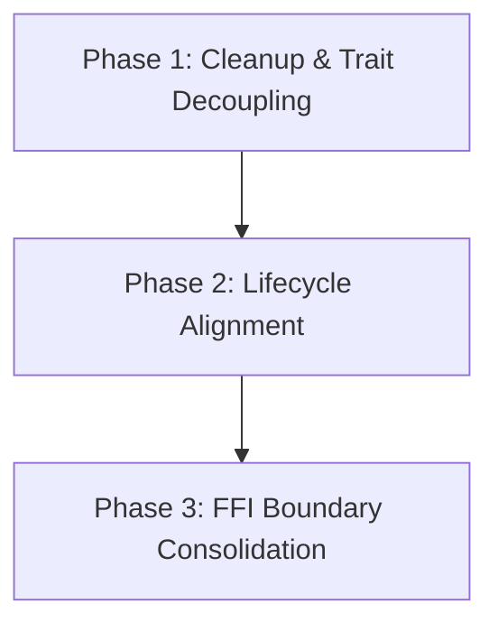

# docs/REFACTOR_PLAN.md

This document details the refactoring plan for Crawlingo to address the architectural issues identified in the audit.

---

## 1. Summary of Changes

### Phase 1: Cleanup & Trait Decoupling
- **Action:** Delete the dead code file [request_queue.rs](file:///d:/Scraper/src/queue/request_queue.rs). Introduce a unified `Fetcher` trait in [fetcher.rs](file:///d:/Scraper/src/engine/fetcher.rs) to decouple networking from the concrete `wreq` client.
- **Rationale:** Reduces code noise and enables mock transport layers for unit testing.

### Phase 2: Lifecycle Alignment
- **Action:** Modify `Crawler` in [crawler.rs](file:///d:/Scraper/src/crawl/crawler.rs) and `DatasetBuilder` in [builder.rs](file:///d:/Scraper/src/dataset/builder.rs) to accept a shared `Arc<Session>` reference rather than instantiating localized HTTP clients inline. Ensure the Sled database connection is initialized once at the Session level and shared.
- **Rationale:** Fixes connection leakages, respects host-level rate limits across threads, and resolves Sled file lock race conditions.

### Phase 3: FFI Boundary Consolidation
- **Action:** Extract Python-specific types (such as `Option<PyObject>`) from the core Rust structures inside `builder.rs`. Use clean serialization or trait boundaries, mapping language-specific behaviors at the outer FFI layers.
- **Rationale:** Ensures core structures remain platform-agnostic and maintains consistency across the Python and Node.js SDKs.

---

## 2. Refactoring Order & Dependencies

1. **Delete Dead Code:** Remove the unused `request_queue.rs` file first to clean up compilation targets.
2. **Implement Fetcher Trait:** Refactor `fetcher.rs` and introduce strategy bounds.
3. **Session Alignment:** Update `crawler.rs` and `builder.rs` to consume shared session configurations.
4. **FFI Type Separation:** Clean up core Rust structures by removing Python-specific GIL fields.
5. **Update SDK Mapping Files:** Rebuild `src/lib.rs` and `sdk/nodejs/native/src/lib.rs` to match the updated constructor signatures.

---

## 3. Risks & Mitigations

- **Risk: Broken SDK Bindings**
  - *Mitigation:* Recompile bindings (`maturin develop` and `npm run build`) after each step and run the SDK wrapper tests to catch FFI signature mismatches early.
- **Risk: Performance Bottlenecks**
  - *Mitigation:* Run the criterion benchmark suite before and after refactoring to ensure modifications do not introduce regression delays in DOM tree construction or selector matching.

---

## 4. Verification Prerequisites

Before initiating any refactoring, ensure:
1. All existing Rust tests (`cargo test`) pass.
2. Criterion benchmarks (`cargo bench --bench selector`) are run to establish performance baselines.
3. Python tests (`pytest` inside `sdk/python/`) and Node.js tests (`npm test` inside `sdk/nodejs/`) are verified as green.
