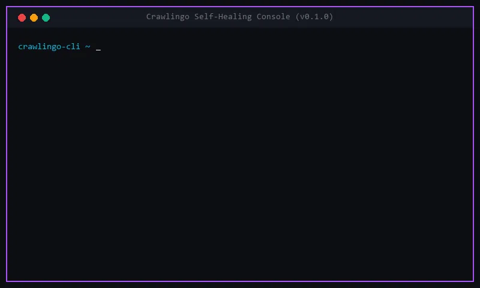

<h1 align="center">
    <a href="https://crawlingo.dev">
        
    </a>
    <br>
    <small>Crawlingo Python SDK - Self-Healing Web Scraping for Python</small>
</h1>

<p align="center">
    <a href="https://github.com/Vamshavardhan50/crawlingo/actions/workflows/ci.yml"></a>
    <a href="https://pypi.org/project/crawlingo/"></a>
    <a href="https://pypi.org/project/crawlingo/"></a>
    <a href="https://github.com/Vamshavardhan50/crawlingo/blob/main/LICENSE"></a>
</p>

<p align="center">
    <a href="#installation"><strong>Installation</strong></a>
    &middot;
    <a href="#why-crawlingo"><strong>Why Crawlingo</strong></a>
    &middot;
    <a href="#features"><strong>Core Features</strong></a>
    &middot;
    <a href="#quick-start"><strong>Quick Start</strong></a>
    &middot;
    <a href="#ai-benchmarks"><strong>LLM Benchmarks</strong></a>
    &middot;
    <a href="#cli-interface"><strong>CLI Interface</strong></a>
</p>

---

**Crawlingo Python SDK** is a next-generation web data extraction, crawling, and website monitoring library. It wraps a high-performance Rust core in an elegant developer-first Python API, allowing you to build scraping workflows that survive page design shifts.

📚 **Read the full guide and API references at [crawlingo.dev/docs](https://crawlingo.dev/docs)**

---

## 🎥 30-Second Demo

Watch Crawlingo's self-healing DOM selector engine dynamically recover element references when a website's layout/DOM structure drifts:



### How Self-Healing Works Under the Hood:
1. **Drift Detection**: When the target element (e.g., `button#submit.btn-primary`) undergoes styling or structure updates (e.g., renamed to `button#send-btn.btn-primary-new`), traditional scrapers fail and return empty results.
2. **Dynamic DOM Parsing**: Crawlingo's Rust engine intercepts the mismatch, loads the active DOM, and isolates candidates within the parent node coordinates.
3. **Jaro-Winkler Similarity Comparison**: The engine ranks candidates by checking tag names, surrounding attributes, text contents, and deep structural fingerprints.
4. **Auto-Match Recovery**: The candidate with the highest similarity score exceeding the threshold (e.g., **94% confidence**) is automatically bound, updating the cache without breaking your production data pipeline.

---

## 📦 Installation

<a id="installation"></a>

Install the pre-compiled package directly from PyPI:

```bash
pip install crawlingo
```

Alternatively, you can compile from source locally:

```bash
cd sdk/python
pip install .
```

To compile in development mode:

```bash
cd sdk/python
pip install -e .
```

---

## 🚀 Why Crawlingo?

<a id="why-crawlingo"></a>

Traditional scrapers break when websites change their class names, IDs, or HTML structures (**selector drift**). Crawlingo solves this by caching element layout fingerprints and using similarity matching heuristics to self-heal and find drifted elements on the fly.

### Comparison Matrix

| Feature | Crawlingo | Scrapy | Crawl4AI |
|----------|------------|---------|---------|
| Rust Core | ✅ | ❌ | ❌ |
| Python SDK | ✅ | ✅ | ✅ |
| Node SDK | ✅ | ❌ | ❌ |
| AI Agent Ready | ✅ | ⚠️ | ✅ |
| Change Monitoring | ✅ | ❌ | ❌ |
| Dataset Extraction | ✅ | ⚠️ | ⚠️ |
| Cross Language | ✅ | ❌ | ❌ |

---

## 🛠️ Core Features

<a id="features"></a>

Crawlingo packs all components required to scrape, watch, and pipe modern web pages under Python:

*   **🧠 Self-Healing DOM Fingerprinting**: Tracks layout changes and leverages Jaro-Winkler calculations dynamically. [Learn more](https://crawlingo.dev/docs/features#auto-match-self-healing).
*   **🛡️ Stealth Browser Impersonation**: Bypasses bot verification systems (Cloudflare, etc.) using high-performance HTTP/2 TLS fingerprint rotation. [Learn more](https://crawlingo.dev/docs/features#stealthy-browser-impersonation).
*   **⚡ SIMD-Accelerated Text Anchors**: CSS/XPath is great, but anchoring relative to text values using vector calculations is faster. [Learn more](https://crawlingo.dev/docs/features#text-anchor-simd-accelerated).
*   **🔄 High-Speed Proxy Rotation**: Automatically rotates proxy configurations inside background crawling loops. [Learn more](https://crawlingo.dev/docs/spiders#proxy-rotation).
*   **⏰ Reactive Watch Monitors**: Run background threads that poll websites and notify handlers upon layout shifts or price changes. [Learn more](https://crawlingo.dev/docs/features#change-monitoring-watches).
*   **🤖 Built-in MCP Server**: Native server that connects scraping tool functions straight to Claude Code or Cursor. [Learn more](https://crawlingo.dev/docs/ai/mcp-server).
*   **📦 Schema-Driven Datasets**: Map results and export them straight to JSON, CSV, Apache Arrow, or Pandas DataFrames. [Learn more](https://crawlingo.dev/docs/features#multi-format-exports).

---

## ⚡ Quick Start

<a id="quick-start"></a>

### 1. Basic Extraction

```python
from crawlingo import Page

page = Page("https://example.com")
print(page.title())
print(page.css("p").text())
```

### 2. Self-Healing Datasets

```python
from crawlingo import Dataset

dataset = (
    Dataset("https://example.com/products")
    .auto_match(True) # Learn & heal selectors automatically
    .field("title", "h1.product-title")
    .field("price", "span.price")
    .build()
)

print(dataset.to_dict())
dataset.to_csv("products.csv")
```

### 3. Watch Monitor for Changes

```python
import asyncio
from crawlingo import Watch

def on_price_update(event):
    print(f"Price updated from {event.old_value} to {event.new_value}!")

async def main():
    watch = (
        Watch("https://example.com/item")
        .field("price", "span.item-price")
        .interval(60)
        .on_price_change(on_price_update)
    )
    await watch.run_async()

if __name__ == "__main__":
    asyncio.run(main())
```

---

## 🤖 AI LLM Ingestion & Benchmarking

<a id="ai-benchmarks"></a>

For web parsing pipelines feeding LLM context or RAG indices, Crawlingo provides structured inputs. The table below outlines how different AI models compare on processing raw scraped web pages for automated RAG/extraction tasks:

| LLM Model | Context Window | Speed (tok/s) | Avg. Cost / 1M Tok | Markdown Parsing Accuracy | Native MCP Support |
|-----------|----------------|---------------|--------------------|---------------------------|---------------------|
| **Claude 3.5 Sonnet** | 200k | ~80 | $3.00 / $15.00 | 👑 **98%** (Best for tables/JSON) | ✅ Native |
| **GPT-4o** | 128k | ~90 | $2.50 / $10.00 | **95%** (Excellent formatting) | ✅ Via Gateway |
| **Gemini 1.5 Pro** | 2M | ~60 | $1.25 / $5.00 | **92%** (Huge content ingestion) | ⚠️ Experimental |
| **Llama 3.1 70B** | 128k | ~45 | $0.60 / $0.60 | **88%** (Great open-source alternative) | ❌ Needs wrapper |

---

## 🛠️ CLI Interface

<a id="cli-interface"></a>

Crawlingo provides a built-in command-line interface:

### 1. Interactive Shell
Launch a Python REPL preloaded with crawlingo:
```bash
crawlingo shell https://example.com
```

### 2. Direct Extraction
Extract matching elements directly from the command line:
```bash
crawlingo extract https://example.com --css "h1"
```

### 3. Start MCP Server
Expose scraping tools to LLMs:
```bash
crawlingo mcp --host 127.0.0.1 --port 8000
```

---

## 📝 License

MIT License. See [LICENSE](../../LICENSE) file.
